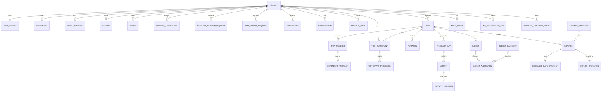
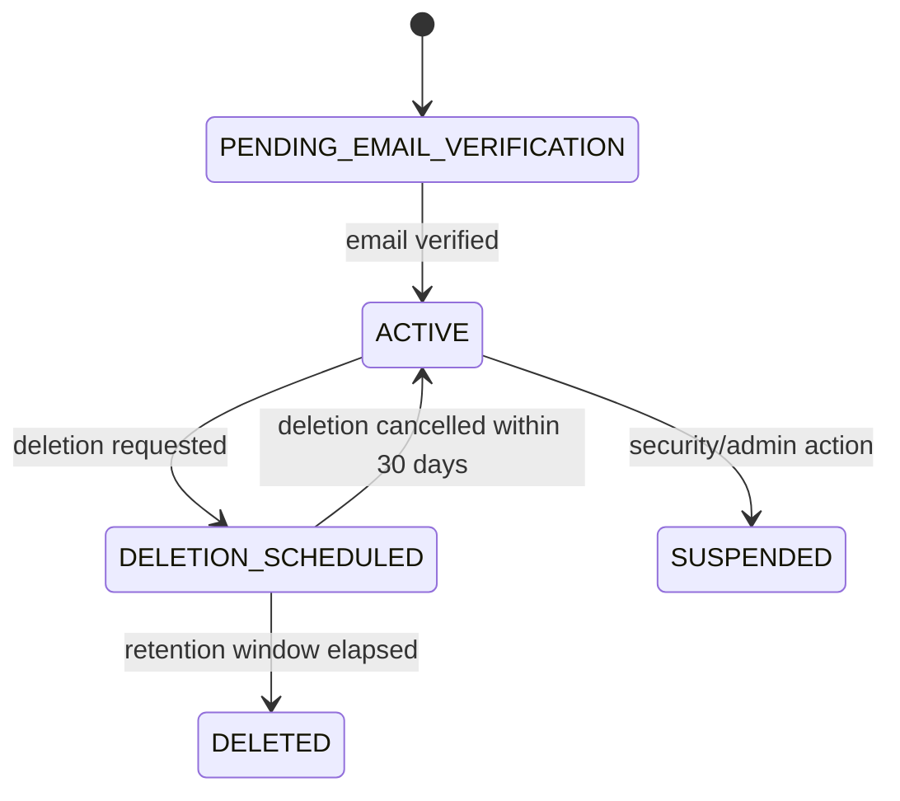
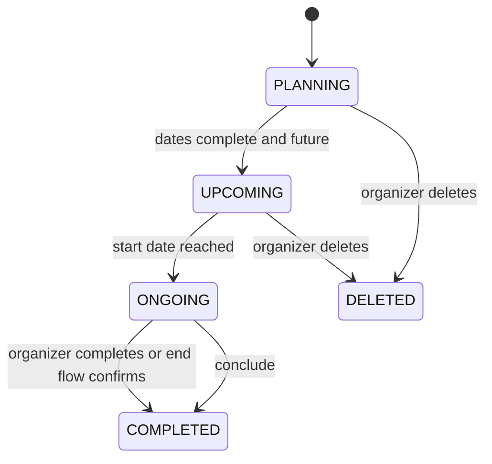
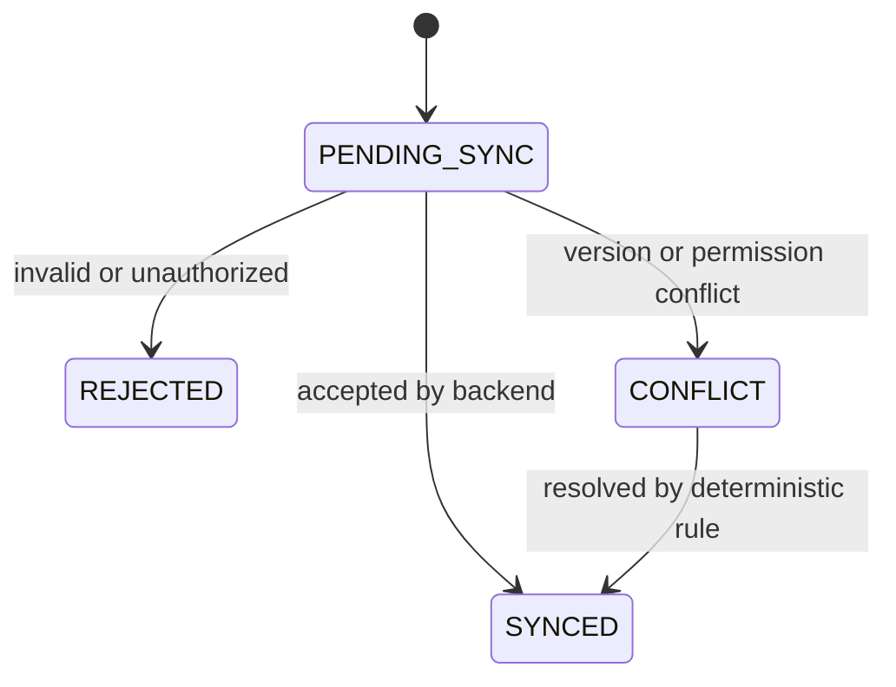

# Tripi - Modelo de Dominio, Contratos e Plano do MVP

**Versao:** 0.1
**Data:** 18 de setembro de 2026
**Status:** especificacao documental inicial para implementacao incremental

## 1. Premissas e decisoes

### Fontes documentais utilizadas

- `docs/Tripi-Arquitetura-Tecnica-v0.1 (1).md`, baseline tecnico aprovado.
- `docs/Tripi-Fundacao-do-Produto-v0.1.md`, decisoes iniciais aprovadas.
- `docs/Tripi-Experiencia-Navegacao-Fluxos-MVP-v0.1.md`, especificacao inicial aprovada por direcao recomendada.
- Fundacao tecnica criada no commit `94019cc chore: establish Tripi technical foundation`, somente para nomenclatura, estrutura e limites tecnicos.

### Escopo coberto

Este documento cobre o MVP publicavel do Tripi para Android e iOS: conta, autenticacao, sessoes, consentimentos, perfil, planos, entitlements, viagens, viajantes, dependentes, participantes, convites, papeis, permissoes, roteiro, orcamento, gastos, moedas, taxas de conversao, auditoria, exportacao, exclusao de conta, recuperacao de conta e analytics tecnicos sem conteudo privado.

### Termos oficiais

- **Conta:** identidade interna do usuario no backend Tripi.
- **Usuario:** pessoa com login proprio, maior de 18 anos.
- **Dependente:** viajante sem login proprio, vinculado a um usuario responsavel.
- **Organizador:** proprietario de uma viagem e responsavel por conteudo, convites e permissoes.
- **Convidado Free:** participante com conta Free, acesso limitado.
- **Convidado Premium autorizado:** participante Premium com autorizacao granular do organizador.
- **Plano:** oferta comercial, como Free ou Premium.
- **Entitlement:** direito efetivo reconhecido pelo backend, incluindo `BETA_PREMIUM`.
- **Viagem ativa:** viagem que consome limite ativo do plano.

### Decisoes herdadas

- Backend em Java 25, Spring Boot 4.1.x, monolito modular.
- API REST versionada em `/v1`; OpenAPI e cliente TypeScript gerado.
- PostgreSQL 18, Flyway, JPA/Hibernate e SQL explicito quando necessario.
- Autenticacao por e-mail/senha, Google e Apple, com backend Tripi como autoridade.
- Tokens sociais provam identidade, mas nao substituem conta interna.
- Refresh tokens rotativos, revogaveis e com deteccao de reutilizacao indevida.
- RevenueCat normaliza assinaturas; backend persiste entitlements e aplica regras.
- Free permite uma viagem ativa; Premium permite viagens ativas ilimitadas.
- Convidado Free nunca acessa informacoes financeiras.
- Premium nao concede acesso automatico a dados de terceiros.
- Dependentes nao possuem login.
- Downgrade nao exclui dados; viagens excedentes ficam em consulta.
- Offline completo do MVP e registro de gastos offline sao Premium.

### Pontos ainda nao definidos

- Algoritmo exato de senha forte, tempo de vida dos tokens e politicas finas de rate limiting.
- Tabelas definitivas de categorias padrao e capas seguras do produto.
- Contratos especificos de provedores Google Places, Resend, RevenueCat, PostHog e Sentry.
- Regras finais de precificacao localizada e identificadores comerciais das lojas.
- Formato final dos arquivos de exportacao PDF/CSV.
- Politica operacional detalhada de suporte/admin, alem de auditoria tecnica minima.

### Conflitos encontrados e resolucao aplicada

- A Fundacao do Produto cita checklist, anexos e documentos em matrizes iniciais, enquanto Experiencia e Fluxos remove checklist dedicado, documentos e anexos do MVP. Pela ordem de autoridade, o escopo do MVP exclui esses modulos proprios; pendencias podem ser derivadas de dados reais existentes.
- A Fundacao cita pendencias, reservas e pagamentos no painel contextual amplo. Experiencia restringe o MVP a dados que realmente existam no escopo aprovado. Portanto, reservas e transportes podem existir apenas como atividades comuns do roteiro.
- A especificacao tecnica lista `Notifications` como modulo logico, mas o prompt pede analytics tecnicos e fluxos de conta. Este documento inclui notificacoes somente como dependencia de Identity/Collaboration/Entitlements, nao como feature de negocio propria.

## 2. Modulos do dominio

### Identity

- **Responsabilidade:** cadastro, login, metodos sociais, verificacao de e-mail, recuperacao de senha, tokens, sessoes e autenticacao recente.
- **Entidades:** `Account`, `Credential`, `SocialIdentity`, `EmailVerificationToken`, `PasswordResetToken`, `Session`, `Device`.
- **Casos de uso:** criar conta, autenticar, renovar token, revogar sessao, verificar e-mail, solicitar/confirmar recuperacao de senha, vincular metodo social.
- **Dados que possui:** hash de senha, metodos de login, tokens opacos hashados, dispositivo, IP tecnico, user-agent resumido.
- **Dependencias permitidas:** Users para perfil inicial; Audit para eventos sensiveis; Notifications para e-mails transacionais; Entitlements para estado de beta se necessario.
- **Eventos:** publica `AccountRegistered`, `EmailVerified`, `LoginSucceeded`, `SessionRevoked`, `PasswordChanged`.
- **Fronteiras:** nao acessa viagens, gastos ou convites diretamente.

### Users

- **Responsabilidade:** perfil, preferencias de idioma, moeda, tema e dados pessoais minimos.
- **Entidades:** `UserProfile`, `UserPreference`, `AccountDeletionRequest`, `DataExportRequest`, `ConsentAcceptance`.
- **Casos de uso:** consultar/editar perfil, trocar idioma/moeda/tema, solicitar exportacao, solicitar/cancelar exclusao, registrar consentimentos.
- **Dados que possui:** nome, e-mail normalizado via conta, idioma, moeda preferencial, tema, consentimentos.
- **Dependencias permitidas:** Identity para autenticacao; Audit; Entitlements para exportacao Premium comercial quando aplicavel, lembrando que exportacao pessoal e para todos.
- **Eventos:** publica `ProfileUpdated`, `ConsentAccepted`, `AccountDeletionRequested`, `DataExportRequested`.
- **Fronteiras:** nao decide permissao dentro da viagem; isso pertence a Collaboration/Trips.

### Trips

- **Responsabilidade:** viagens, status, destino principal, datas, fuso, moeda principal, capa, viajantes e dependentes.
- **Entidades:** `Trip`, `TripTraveler`, `DependentTraveler`, `TripActiveSelection`.
- **Casos de uso:** criar, editar, concluir, excluir, selecionar viagem ativa, gerenciar viajantes/dependentes.
- **Dados que possui:** nome, destino, coordenadas minimas, periodo, timezone, moeda principal, status, owner.
- **Dependencias permitidas:** Entitlements para limites Free/Premium; Collaboration para participantes; Audit.
- **Eventos:** publica `TripCreated`, `TripUpdated`, `TripCompleted`, `TripDeleted`, `ActiveTripChanged`.
- **Fronteiras:** nao armazena orcamento, gastos, permissoes granulares ou atividades.

### Itinerary

- **Responsabilidade:** dias de roteiro e atividades ordenadas.
- **Entidades:** `ItineraryDay`, `Activity`, `ActivityLocation`.
- **Casos de uso:** listar roteiro, criar/editar/reordenar/excluir atividade, abrir local por deep link.
- **Dados que possui:** data local, titulo, horarios opcionais, local minimo, observacao, categoria visual, ordem.
- **Dependencias permitidas:** Trips para periodo e timezone; Collaboration para permissao; Audit.
- **Eventos:** publica `ActivityCreated`, `ActivityUpdated`, `ActivityReordered`, `ActivityDeleted`.
- **Fronteiras:** nao implementa mapa interno, reservas ou transporte como modulo proprio.

### Budget

- **Responsabilidade:** orcamento planejado por viagem e categorias.
- **Entidades:** `Budget`, `BudgetCategory`, `BudgetAllocation`.
- **Casos de uso:** definir total, distribuir por categoria, consultar saldo planejado.
- **Dados que possui:** valor planejado decimal, moeda de referencia, categorias padrao/personalizadas.
- **Dependencias permitidas:** Trips para moeda principal; Collaboration para acesso financeiro; Entitlements para recursos Premium; Audit.
- **Eventos:** publica `BudgetDefined`, `BudgetCategoryChanged`.
- **Fronteiras:** nao armazena gastos realizados.

### Expenses

- **Responsabilidade:** gastos realizados, moedas, conversoes, sincronizacao pendente e indicadores financeiros.
- **Entidades:** `Expense`, `ExpenseCategory`, `ExchangeRateSnapshot`, `OfflineOperation`.
- **Casos de uso:** registrar/editar/excluir gasto, listar por filtros, sincronizar gasto offline, calcular totais.
- **Dados que possui:** valor original, moeda original, valor de referencia, taxa usada, responsavel, categoria, estado de sincronizacao.
- **Dependencias permitidas:** Trips, Budget, Collaboration, Entitlements, Audit.
- **Eventos:** publica `ExpenseCreated`, `ExpenseUpdated`, `ExpenseDeleted`, `OfflineExpenseAccepted`, `OfflineExpenseRejected`.
- **Fronteiras:** nao altera historico de taxa de cambio silenciosamente.

### Collaboration

- **Responsabilidade:** participantes, convites, papeis, autorizacoes granulares e revogacao.
- **Entidades:** `TripParticipant`, `Invitation`, `ParticipantPermission`.
- **Casos de uso:** convidar, aceitar convite, revogar convite, remover participante, alterar permissao.
- **Dados que possui:** papel, status, e-mail convidado, permissao financeira/roteiro/offline quando aplicavel.
- **Dependencias permitidas:** Trips para ownership; Users/Identity para conta; Entitlements para Premium do convidado; Audit; Notifications.
- **Eventos:** publica `InvitationSent`, `InvitationAccepted`, `ParticipantPermissionChanged`, `ParticipantRemoved`.
- **Fronteiras:** nao concede Premium nem decide limites comerciais sozinho.

### Entitlements

- **Responsabilidade:** planos, teste Premium, beta, assinaturas, downgrade e direitos efetivos.
- **Entidades:** `Plan`, `Entitlement`, `Subscription`, `PremiumTrial`, `StorePurchaseEvent`.
- **Casos de uso:** consultar entitlement, iniciar teste, processar webhook RevenueCat, restaurar compra, aplicar downgrade.
- **Dados que possui:** fonte, validade, estado da assinatura, identificador estavel do usuario no RevenueCat.
- **Dependencias permitidas:** Users, Trips para escolha de viagem ativa no downgrade; Audit.
- **Eventos:** publica `EntitlementGranted`, `EntitlementExpired`, `SubscriptionChanged`, `DowngradeApplied`.
- **Fronteiras:** nao processa pagamento diretamente; lojas e RevenueCat sao fontes externas.

### Notifications

- **Responsabilidade:** e-mails transacionais encapsulados por interface substituivel.
- **Entidades:** `NotificationTemplate`, `NotificationDispatch`.
- **Casos de uso:** enviar verificacao de e-mail, recuperacao, convite e alertas sensiveis.
- **Dados que possui:** metadados tecnicos de envio, idioma, tipo, status.
- **Dependencias permitidas:** Identity, Collaboration, Entitlements, Audit.
- **Eventos:** consome eventos de outros modulos; publica `NotificationDispatchFailed`.
- **Fronteiras:** nao inclui dados financeiros sensiveis no conteudo.

### Audit

- **Responsabilidade:** trilha de acoes sensiveis, correlacao, seguranca e compliance.
- **Entidades:** `AuditEvent`, `ApiIdempotencyKey`, `ProductAnalyticsEvent`.
- **Casos de uso:** registrar alteracoes de permissao, financeiro, assinatura, sessao, exclusao, exportacao e eventos tecnicos.
- **Dados que possui:** ator, alvo, tipo, timestamp, correlation ID, resumo tecnico sem segredo.
- **Dependencias permitidas:** todos os modulos podem publicar eventos; Audit nao chama regras de negocio dos outros.
- **Eventos:** consome eventos sensiveis; pode publicar alertas operacionais.
- **Fronteiras:** nao armazena tokens, senhas, destinos vinculaveis em analytics, valores financeiros ou conteudo privado desnecessario.

## 3. Entidades e relacionamentos

### Diagrama ER conceitual



### Catalogo de entidades

| Entidade | Tabela sugerida | Finalidade | Campos principais | Obrigatorio/default | Unicidade/indices | Relacionamentos | Exclusao/retencao | Sensivel/auditavel |
| --- | --- | --- | --- | --- | --- | --- | --- | --- |
| Account | `accounts` | Conta interna | `id`, `email`, `status`, `email_verified_at`, `created_at`, `deleted_at`, `version` | e-mail e status obrigatorios; status `PENDING_EMAIL_VERIFICATION` | `email_normalized` unico parcial | 1:1 Profile, 1:N Session | soft delete, recuperavel 30 dias | e-mail sensivel; status auditavel |
| UserProfile | `user_profiles` | Dados pessoais minimos | `account_id`, `display_name`, `birthdate_confirmed`, `support_email_locale` | nome obrigatorio | PK `account_id` | Account | removido/anomizado na exclusao definitiva | nome sensivel |
| UserPreference | `user_preferences` | Preferencias | `account_id`, `locale`, `currency_code`, `theme` | `pt-BR` ou dispositivo; tema `SYSTEM` | PK `account_id` | Account | acompanha conta | auditavel em alteracoes |
| Credential | `credentials` | Login por senha | `account_id`, `password_hash`, `password_changed_at` | hash obrigatorio | PK `account_id` | Account | removido na exclusao definitiva | segredo; nunca logar |
| SocialIdentity | `social_identities` | Google/Apple | `provider`, `provider_subject`, `account_id`, `email_claim` | provider obrigatorio | unico `(provider, provider_subject)` | Account | removido na exclusao | sensivel |
| EmailVerificationToken | `email_verification_tokens` | Verificacao | `token_hash`, `account_id`, `expires_at`, `used_at` | expiracao obrigatoria | hash unico | Account | TTL curto | segredo hashado |
| PasswordResetToken | `password_reset_tokens` | Recuperacao | `token_hash`, `account_id`, `expires_at`, `used_at` | expiracao obrigatoria | hash unico | Account | TTL curto | segredo hashado |
| Session | `sessions` | Sessao e refresh | `id`, `account_id`, `refresh_token_hash`, `device_id`, `expires_at`, `revoked_at`, `reuse_detected_at` | status ativo se `revoked_at` nulo | indice account/status | Account, Device | revogada e retida por auditoria limitada | segredo hashado, auditavel |
| Device | `devices` | Dispositivo | `id`, `account_id`, `name`, `platform`, `last_seen_at`, `push_token_hash` | plataforma obrigatoria | account + device fingerprint | Account | removido na exclusao | token sensivel |
| ConsentAcceptance | `consent_acceptances` | Aceites versionados | `account_id`, `document_type`, `version`, `locale`, `accepted_at` | todos obrigatorios | indice account/document/version | Account | retencao legal | auditavel |
| AccountDeletionRequest | `account_deletion_requests` | Exclusao recuperavel | `account_id`, `requested_at`, `scheduled_for`, `cancelled_at`, `completed_at` | scheduled +30 dias | account ativo unico | Account | retencao ate conclusao + auditoria | altamente auditavel |
| DataExportRequest | `data_export_requests` | Exportacao pessoal | `account_id`, `status`, `requested_at`, `completed_at`, `download_expires_at` | status `REQUESTED` | indice account/status | Account | arquivo expira | auditavel |
| Trip | `trips` | Viagem | `id`, `owner_account_id`, `name`, `destination_name`, `timezone`, `currency_code`, `starts_on`, `ends_on`, `status`, `active_state`, `deleted_at`, `version` | status `PLANNING`; active conforme limite | owner/status, active unique control | Account | soft delete; compartilhada requer transferencia | destino sensivel |
| TripTraveler | `trip_travelers` | Viajante da viagem | `trip_id`, `account_id`, `display_name`, `traveler_type` | display obrigatorio | trip + account/dependent | Trip, Account | removido com trip | sensivel |
| DependentTraveler | `dependent_travelers` | Dependente sem login | `responsible_account_id`, `display_name`, `birth_date`, `relationship` | nome/apelido obrigatorio | responsavel + nome opcional | TripTraveler | minimizacao; sem login | dado de menor sensivel |
| TripActiveSelection | `trip_active_selections` | Viagem ativa por conta | `account_id`, `trip_id`, `selected_at`, `reason` | obrigatorio no Free quando houver ativas | unico account | Account, Trip | substituido historicamente | auditavel |
| TripParticipant | `trip_participants` | Participacao | `trip_id`, `account_id`, `role`, `status`, `joined_at`, `removed_at` | role `ORGANIZER` ou `GUEST` | unico trip/account ativo | Trip, Account | remocao logica | auditavel |
| Invitation | `invitations` | Convite | `trip_id`, `email`, `token_hash`, `status`, `expires_at`, `accepted_by_account_id` | expiracao obrigatoria | token unico; trip/email pendente | Trip, Account | expira/revoga | e-mail sensivel |
| ParticipantPermission | `participant_permissions` | Autorizacao granular | `participant_id`, `permission`, `granted`, `granted_by`, `changed_at` | false por padrao | unico participant/permission | Participant | historico auditado | auditavel |
| ItineraryDay | `itinerary_days` | Dia local do roteiro | `trip_id`, `local_date`, `position` | gerado por periodo | unico trip/date | Trip | removido com trip | nao sensivel isolado |
| Activity | `activities` | Atividade | `day_id`, `title`, `starts_at_local`, `ends_at_local`, `position`, `notes`, `category`, `created_by`, `version` | titulo obrigatorio | day/position | Day, Location | soft delete | conteudo privado |
| ActivityLocation | `activity_locations` | Local minimo | `activity_id`, `provider_place_id`, `name`, `address`, `latitude`, `longitude` | opcional | provider id quando houver | Activity | regras do provedor | localizacao sensivel |
| Budget | `budgets` | Orcamento da viagem | `trip_id`, `currency_code`, `total_amount`, `version` | moeda da viagem | unico trip | Trip | soft com trip | financeiro sensivel |
| BudgetCategory | `budget_categories` | Categoria planejada | `id`, `owner_account_id`, `name`, `kind`, `active` | padrao ou custom | owner/name parcial | Account | inativacao | nao financeiro isolado |
| BudgetAllocation | `budget_allocations` | Valor por categoria | `budget_id`, `category_id`, `amount` | amount >= 0 | budget/category | Budget | removido com budget | financeiro sensivel |
| Expense | `expenses` | Gasto | `trip_id`, `payer_account_id`, `description`, `original_amount`, `original_currency`, `reference_amount`, `reference_currency`, `occurred_at`, `sync_state`, `version` | moeda e valor obrigatorios | trip/date; idempotency key | Trip, Category, Rate | soft delete | financeiro sensivel |
| ExpenseCategory | `expense_categories` | Categoria de gasto | `owner_account_id`, `name`, `kind`, `active` | padrao/custom | owner/name | Account | inativacao | nao financeiro isolado |
| ExchangeRateSnapshot | `exchange_rate_snapshots` | Taxa usada | `base_currency`, `quote_currency`, `rate`, `rate_date`, `source`, `manual` | taxa decimal obrigatoria | par/data/source | Expense | preservar historico | financeiro auditavel |
| OfflineOperation | `offline_operations` | Fila sincronizada | `idempotency_key`, `account_id`, `device_id`, `entity_type`, `status`, `payload_hash`, `created_at` | status `PENDING_SYNC` | idempotency unica | Account, Expense | retencao limitada | payload hash, auditavel |
| Plan | `plans` | Plano comercial | `code`, `name`, `active` | Free/Premium | code unico | Entitlement | historico | auditavel |
| Entitlement | `entitlements` | Direito efetivo | `account_id`, `type`, `source`, `starts_at`, `ends_at`, `status` | source obrigatoria | account/type/status | Account | historico preservado | auditavel |
| Subscription | `subscriptions` | Assinatura | `account_id`, `provider`, `provider_customer_id`, `status`, `renews_at`, `grace_ends_at` | provider RevenueCat | provider/customer unico | Account | historico | sensivel comercial |
| PremiumTrial | `premium_trials` | Teste Premium | `account_id`, `started_at`, `ends_at`, `status` | uma vez por conta | account unico | Account | historico | auditavel |
| StorePurchaseEvent | `store_purchase_events` | Webhook compra | `provider_event_id`, `received_at`, `processed_at`, `payload_hash`, `status` | id provider obrigatorio | provider_event unico | Subscription | retencao operacional | sem payload sensivel claro |
| NotificationDispatch | `notification_dispatches` | Envio transacional | `type`, `account_id`, `locale`, `status`, `provider_message_id` | tipo/status obrigatorios | provider id | Account | retencao limitada | e-mail sensivel evitado |
| AuditEvent | `audit_events` | Auditoria | `actor_account_id`, `action`, `target_type`, `target_id`, `occurred_at`, `correlation_id`, `metadata_redacted` | acao obrigatoria | alvo/data | varios | retencao compliance | auditavel |
| ApiIdempotencyKey | `api_idempotency_keys` | Idempotencia API | `account_id`, `key`, `request_hash`, `response_hash`, `expires_at` | expiracao obrigatoria | account/key unico | Account | TTL | tecnico sensivel |
| ProductAnalyticsEvent | `product_analytics_events` | Analytics tecnico permitido | `account_id`, `event_name`, `occurred_at`, `properties_redacted` | nome obrigatorio | event/date | Account | agregacao/anonimizacao | sem conteudo privado |

## 4. Identificadores e padroes

- **IDs:** UUID v7 ou UUID equivalente ordenavel para entidades de dominio; tokens externos sempre opacos e armazenados como hash.
- **Timestamps:** `created_at`, `updated_at`, `deleted_at` em `timestamptz` UTC.
- **Fusos:** viagem possui timezone principal IANA; instantes globais usam UTC; datas do roteiro usam `date` local da viagem.
- **Valores monetarios:** decimal, nunca float; armazenar valor original e moeda ISO 4217.
- **Moedas:** `char(3)` ISO 4217 em maiusculas.
- **Taxas de conversao:** decimal com fonte, data, par de moedas e flag manual; historico preservado.
- **Enumeracoes:** strings estaveis em ingles tecnico: `ACTIVE`, `PLANNING`, `PENDING_SYNC`.
- **Versionamento otimista:** coluna `version` em entidades editaveis por usuario.
- **Exclusao logica:** `deleted_at` para conta em janela de recuperacao, viagens, atividades e gastos.
- **Idempotencia:** header `Idempotency-Key` obrigatorio para criacoes sensiveis e sincronizacao offline.
- **Auditoria:** toda acao sensivel registra ator, alvo, data, correlation ID e metadados minimizados.
- **Paginacao:** cursor-based por padrao; offset apenas para listas administrativas internas futuras.
- **Ordenacao:** atividades usam `position` decimal ou string ordenavel por dia; reordenacao atomica por versao.
- **Nomes tecnicos:** ingles para tabelas, campos, enums, paths e schemas; textos de produto em PT/EN por i18n.

## 5. Estados e ciclos de vida

### Conta



- Invalidas: `DELETED` para `ACTIVE` depois de exclusao definitiva; criar login para menor dependente.
- Responsaveis: usuario para cadastro/exclusao/cancelamento; sistema para expiracao; suporte somente quando necessario e auditado.

### Viagem



- Invalidas: `COMPLETED` voltar para `ONGOING` sem decisao futura; excluir viagem compartilhada se organizador precisa transferir antes da exclusao de conta.

### Convite

Estados: `PENDING`, `ACCEPTED`, `EXPIRED`, `REVOKED`. Apenas organizador envia/revoga. Aceite exige conta e aceite explicito.

### Participante

Estados: `ACTIVE`, `REMOVED`, `LEFT`, `PERMISSION_REVOKED`. Convidado nao remove terceiros nem altera permissoes.

### Assinatura e teste Premium

Assinatura: `NONE`, `TRIALING`, `ACTIVE`, `GRACE_PERIOD`, `CANCELLED`, `EXPIRED`. Teste: `AVAILABLE`, `ACTIVE`, `USED`, `EXPIRED`. Backend aplica entitlements; app nunca concede Premium sozinho.

### Gasto pendente de sincronizacao



### Exclusao da conta

Solicitacao exige autenticacao recente. Durante 30 dias, conta fica `DELETION_SCHEDULED`; depois ocorre exclusao definitiva operacional, com backups retendo copias inacessiveis por ate 90 dias.

## 6. Planos, papeis e permissoes

### Separacao conceitual

- **Plano comercial:** Free ou Premium.
- **Entitlement:** direito efetivo calculado pelo backend, incluindo beta e periodo de tolerancia.
- **Papel na viagem:** organizador ou convidado.
- **Autorizacao granular:** permissoes de roteiro, financeiro e colaboracao dadas pelo organizador.
- **Propriedade do registro:** autor/responsavel de gasto ou criador de atividade; restringe edicao de terceiros.

| Recurso | Organizador Free | Organizador Premium | Convidado Free | Convidado Premium sem autorizacao | Convidado Premium autorizado | Dependente | Sistema/suporte |
| --- | --- | --- | --- | --- | --- | --- | --- |
| Visualizar painel completo | Sim | Sim | Nao | Nao | Sim | Nao login | Suporte nao acessa conteudo sem base operacional |
| Visualizar painel resumido | Sim | Sim | Sim | Sim | Sim | Nao login | Tecnico agregado |
| Criar viagem | 1 ativa | Ilimitadas | Nao | Nao | Nao | Nao | Nao |
| Editar viagem | Sim se organizador | Sim se organizador | Nao | Nao | Nao | Nao | Nao |
| Excluir viagem | Sim se organizador | Sim se organizador | Nao | Nao | Nao | Nao | Nao |
| Convidar/revogar | Sim ate limite | Sim com uso justo | Nao | Nao | Nao | Nao | Nao |
| Visualizar roteiro completo | Sim | Sim | Nao | Sim se Premium permite leitura | Sim | Nao login | Nao |
| Ver roteiro do dia | Sim | Sim | Sim | Sim | Sim | Nao login | Nao |
| Criar/editar roteiro | Sim | Sim | Nao | Nao | Sim | Nao | Nao |
| Orcamento e gastos | Sim | Sim | Nao | Nao | Com autorizacao financeira | Nao | Nao |
| Registrar gasto | Sim | Sim | Nao | Nao | Proprio gasto | Nao | Nao |
| Editar gasto de terceiros | Sim | Sim | Nao | Nao | Nao | Nao | Nao |
| Exportar dados pessoais | Sim | Sim | Sim dos proprios dados | Sim | Sim | Responsavel exporta dados do dependente | Processo tecnico |
| Operar offline | Nao | Sim | Nao | Sim somente dados permitidos e sincronizados | Sim dentro das permissoes | Nao | Nao |

Confirmacoes: convidado Free nunca acessa financas; Premium nao concede acesso automatico; dependentes nao possuem login; organizador controla participantes.

## 7. Regras de isolamento e seguranca

- Toda consulta filtra por `account_id` autenticado e participacao ativa; IDs globais nunca bastam para autorizar.
- Viagens sao isoladas por participante ativo; dados financeiros exigem autorizacao financeira explicita.
- Informacoes financeiras ficam ocultas por padrao para convidados.
- Ownership: organizador administra viagem; convidados autorizados editam somente escopo permitido; convidado autorizado edita apenas proprios gastos.
- Backend aplica toda autorizacao; mobile apenas reflete estado.
- Prevencao de enumeracao: respostas neutras em login, recuperacao e convite; `404` ou `403` conforme politica anti-IDOR sem revelar existencia indevida.
- IDOR: toda rota com `{id}` valida ownership/participacao/permissao antes de acessar dados.
- Acoes sensiveis exigem auditoria: login novo, troca de senha/e-mail, vinculo social, permissao, financeiro, assinatura, exclusao/exportacao.
- Rate limiting conceitual: login, recuperacao, reenvio de e-mail, convites, autocomplete e sincronizacao.
- Revogacao de sessoes apos troca de senha ou indicio de comprometimento.
- Autenticacao recente para exclusao, exportacao, troca de e-mail/senha, encerramento remoto e transferencia de propriedade.
- Dependentes: dados minimos, sem login, sem documentos no MVP.
- Nunca logar ou enviar para analytics: senhas, tokens, refresh tokens, valores financeiros, destinos vinculaveis, nomes, e-mails, descricoes, observacoes e conteudo de roteiro.

## 8. Contratos REST planejados

O contrato planejado completo esta em `docs/contracts/tripi-api-mvp-v0.1.yaml`. Catalogo resumido:

| Metodo | Caminho | Modulo | Objetivo | Auth/permissao | Idempotencia | HTTP principais | Auditoria |
| --- | --- | --- | --- | --- | --- | --- | --- |
| POST | `/v1/auth/register` | Identity | Criar conta | Publico | Sim | 201, 409, 422 | `AccountRegistered` |
| POST | `/v1/auth/login` | Identity | Entrar | Publico | Nao | 200, 401, 429 | `LoginSucceeded/Failed` |
| POST | `/v1/auth/refresh` | Identity | Renovar token | Refresh | Sim | 200, 401 | sessao |
| POST | `/v1/auth/logout` | Identity | Encerrar sessao | Usuario | Sim | 204 | `SessionRevoked` |
| POST | `/v1/auth/email-verifications` | Identity | Reenviar verificacao | Publico/usuario | Sim | 202, 429 | envio |
| POST | `/v1/auth/email-verifications/confirm` | Identity | Confirmar e-mail | Token | Sim | 200, 410 | `EmailVerified` |
| POST | `/v1/auth/password-resets` | Identity | Solicitar reset | Publico | Sim | 202, 429 | envio neutro |
| POST | `/v1/auth/password-resets/confirm` | Identity | Redefinir senha | Token | Sim | 204, 410 | `PasswordChanged` |
| GET/PATCH | `/v1/me/profile` | Users | Perfil | Usuario | PATCH sim | 200, 422 | perfil |
| GET/PATCH | `/v1/me/preferences` | Users | Preferencias | Usuario | PATCH sim | 200, 422 | preferencias |
| GET/DELETE | `/v1/me/sessions/{sessionId}` | Identity | Consultar/revogar sessao | Dono | DELETE sim | 200, 204, 404 | sessao |
| GET/POST | `/v1/me/consents` | Users | Listar/aceitar termos | Usuario | POST sim | 200, 201 | consentimento |
| POST/GET | `/v1/me/data-exports` | Users | Exportacao | Usuario | POST sim | 202, 200 | exportacao |
| POST/DELETE | `/v1/me/deletion-request` | Users | Excluir/cancelar | Usuario recente | Sim | 202, 204 | exclusao |
| GET | `/v1/entitlements/me` | Entitlements | Direitos atuais | Usuario | Nao | 200 | nao |
| POST | `/v1/entitlements/trials` | Entitlements | Iniciar teste | Usuario | Sim | 201, 409 | trial |
| POST | `/v1/entitlements/store-events` | Entitlements | Webhook RevenueCat | Assinatura webhook | Sim | 202, 401 | assinatura |
| GET/POST | `/v1/trips` | Trips | Listar/criar | Usuario | POST sim | 200, 201, 402/409 | viagem |
| GET/PATCH/DELETE | `/v1/trips/{tripId}` | Trips | Detalhar/editar/excluir | Participante/organizador | PATCH/DELETE sim | 200, 204, 403 | viagem |
| POST | `/v1/trips/{tripId}/complete` | Trips | Concluir | Organizador | Sim | 200, 409 | viagem |
| PUT | `/v1/trips/{tripId}/active-selection` | Trips | Escolher ativa | Dono | Sim | 200, 409 | downgrade |
| GET/POST | `/v1/trips/{tripId}/travelers` | Trips | Viajantes/dependentes | Organizador | POST sim | 200, 201 | viajante |
| PATCH/DELETE | `/v1/trips/{tripId}/travelers/{travelerId}` | Trips | Editar/remover | Organizador | Sim | 200, 204 | viajante |
| GET/POST | `/v1/trips/{tripId}/participants` | Collaboration | Participantes | Participante/organizador | POST sim | 200, 201 | participante |
| DELETE | `/v1/trips/{tripId}/participants/{participantId}` | Collaboration | Remover | Organizador | Sim | 204 | participante |
| POST/GET | `/v1/trips/{tripId}/invitations` | Collaboration | Convidar/listar | Organizador | POST sim | 201, 200, 429 | convite |
| POST | `/v1/invitations/{token}/accept` | Collaboration | Aceitar convite | Usuario | Sim | 200, 410 | convite |
| DELETE | `/v1/trips/{tripId}/invitations/{invitationId}` | Collaboration | Revogar | Organizador | Sim | 204 | convite |
| PUT | `/v1/trips/{tripId}/participants/{participantId}/permissions` | Collaboration | Permissoes | Organizador | Sim | 200 | permissao |
| GET | `/v1/trips/{tripId}/itinerary` | Itinerary | Roteiro | Participante permitido | Nao | 200 | nao |
| POST | `/v1/trips/{tripId}/activities` | Itinerary | Criar atividade | Organizador/autorizado | Sim | 201 | atividade |
| PATCH/DELETE | `/v1/trips/{tripId}/activities/{activityId}` | Itinerary | Editar/excluir | Organizador/autorizado | Sim | 200, 204 | atividade |
| PUT | `/v1/trips/{tripId}/activities/reorder` | Itinerary | Reordenar | Organizador/autorizado | Sim | 200, 409 | atividade |
| GET/PUT | `/v1/trips/{tripId}/budget` | Budget | Orcamento | Financeiro permitido | PUT sim | 200 | financeiro |
| GET/POST | `/v1/trips/{tripId}/budget/categories` | Budget | Categorias | Financeiro permitido | POST sim | 200, 201 | financeiro |
| GET/POST | `/v1/trips/{tripId}/expenses` | Expenses | Listar/criar gasto | Financeiro permitido | POST sim | 200, 201 | financeiro |
| PATCH/DELETE | `/v1/trips/{tripId}/expenses/{expenseId}` | Expenses | Editar/excluir | Dono/organizador | Sim | 200, 204, 403 | financeiro |
| POST | `/v1/trips/{tripId}/offline-operations` | Expenses | Sincronizar offline | Premium permitido | Sim | 207, 403 | sync |
| GET | `/v1/trips/{tripId}/dashboard` | Trips | Painel contextual | Participante permitido | Nao | 200 | analytics tecnico |
| GET | `/v1/trips/{tripId}/audit-events` | Audit | Auditoria da viagem | Organizador | Nao | 200 | acesso auditoria |
| POST | `/v1/analytics/events` | Audit | Evento tecnico permitido | Usuario | Sim | 202 | analytics minimizado |

Requests e responses usam JSON sem envelope para recursos unitarios; listas paginadas usam objeto com `data` e `page`.

## 9. Padrao de respostas e erros

- **Envelope:** sem envelope para recurso unitario; listas: `{ "data": [], "page": { "nextCursor": null } }`.
- **Datas:** instantes em ISO 8601 UTC; datas locais como `YYYY-MM-DD`.
- **Monetario:** objeto `{ "amount": "123.45", "currency": "USD" }`.
- **Paginacao:** `limit` e `cursor`; resposta com `nextCursor`.
- **Correlation ID:** toda resposta inclui header `X-Correlation-Id`; cliente pode enviar `X-Correlation-Id`.
- **Erros:** `application/problem+json`.

Exemplo de contrato:

```json
{
  "type": "https://api.tripi.app/problems/premium-required",
  "title": "Premium required",
  "status": 402,
  "code": "PREMIUM_REQUIRED",
  "correlationId": "01JEXAMPLE0000000000000000"
}
```

Codigos de dominio: `VALIDATION_FAILED`, `AUTHENTICATION_REQUIRED`, `AUTHORIZATION_DENIED`, `RESOURCE_NOT_FOUND`, `FREE_LIMIT_REACHED`, `PREMIUM_REQUIRED`, `EMAIL_NOT_VERIFIED`, `INVITATION_EXPIRED`, `IDEMPOTENCY_CONFLICT`, `VERSION_CONFLICT`, `SYNC_CONFLICT`, `RECENT_AUTH_REQUIRED`.

## 10. Concorrencia e sincronizacao

- Offline Premium permite consultar dados previamente sincronizados e registrar novos gastos.
- Cada operacao offline envia `Idempotency-Key`, `deviceId`, `clientCreatedAt` e versao conhecida.
- Conflito de atualizacao usa `version`; backend retorna `409 VERSION_CONFLICT` com versao atual resumida.
- Atividades usam reordenacao atomica por dia e versao do conjunto.
- Gasto offline preserva UUID do dispositivo, moeda/valor originais, ultima taxa conhecida e `PENDING_SYNC`.
- Se permissao for revogada antes da sincronizacao, backend rejeita com `403 AUTHORIZATION_DENIED` e registra auditoria.
- Em multiplos dispositivos, backend e fonte de verdade; mobile revalida permissoes e entitlements ao reconectar.

## 11. Assinaturas e downgrade

- RevenueCat e lojas sao fontes de eventos comerciais; backend e fonte de verdade dos entitlements internos.
- `BETA_PREMIUM` desbloqueia recursos na beta sem compra real.
- Teste Premium e unico por conta, por sete dias.
- Renovacao, cancelamento, tolerancia, expiracao e restauracao chegam por eventos idempotentes.
- Downgrade preserva dados; usuario escolhe uma viagem ativa para permanecer no Free.
- Viagens excedentes ficam em consulta; edicao Premium, offline, multiplas moedas e relatorios ficam bloqueados.
- Convidado que perde Premium perde edicao e acesso financeiro imediatamente apos atualizacao do entitlement.

## 12. Privacidade e retencao

- Consentimentos sao versionados por documento, idioma, data e hora.
- Exportacao pessoal disponivel para Free e Premium.
- Exclusao tem janela de recuperacao de 30 dias; backups podem reter dados inacessiveis operacionalmente por ate 90 dias.
- Organizadores devem transferir viagens compartilhadas antes de excluir conta.
- Dependentes coletam apenas nome/apelido, data de nascimento opcional e relacao.
- Localizacao somente em primeiro plano e quando solicitada por funcionalidade.
- Auditoria retida com minimizacao e metadados redigidos.
- Analytics devem remover ou anonimizar identificadores quando agregados.

## 13. Ordem planejada das migrations

Preservar `V1__technical_foundation.sql`.

| Migration futura | Objetivo | Entidades | Dependencias | Riscos | Rollback logico |
| --- | --- | --- | --- | --- | --- |
| V2 | Identidade base | accounts, credentials, social_identities | V1 | seguranca de tokens | desativar contas criadas |
| V3 | Sessoes e dispositivos | sessions, devices | V2 | revogacao incompleta | revogar tudo |
| V4 | Usuarios e consentimentos | profiles, preferences, consents | V2 | LGPD/GDPR | exigir novo aceite |
| V5 | Entitlements | plans, entitlements, trials, subscriptions | V2 | downgrade incorreto | recalcular entitlement |
| V6 | Viagens | trips, active selections | V5 | limite Free | recalcular ativa |
| V7 | Viajantes/dependentes | travelers, dependents | V6 | dados de menores | minimizacao/anominizacao |
| V8 | Colaboracao | participants, invitations, permissions | V6,V5 | IDOR | revogar permissoes |
| V9 | Roteiro | days, activities, locations | V6,V8 | ordenacao | recomputar positions |
| V10 | Orcamento | budgets, categories, allocations | V6,V8 | acesso financeiro | ocultar financeiro |
| V11 | Gastos/cambio | expenses, rates, offline ops | V10,V5 | conversao historica | preservar taxa original |
| V12 | Auditoria/idempotencia | audit_events, idempotency_keys | todos | volume de dados | retencao/particionamento |
| V13 | Exportacao/exclusao | export, deletion requests | V2,V6,V8 | perda indevida | cancelar solicitacao |
| V14 | Analytics tecnico | product_analytics_events | V2 | privacidade | anonimizar/remover |

## 14. Plano incremental de implementacao

| Incremento | Escopo | Dependencias | Backend | Mobile | Testes | Conclusao | Fora |
| --- | --- | --- | --- | --- | --- | --- | --- |
| 1 Conta e autenticacao | cadastro, login, verificacao, reset | V2,V4 | Identity REST, tokens, adapter tecnico de e-mail local configuravel | telas reais de auth | unit, contrato, seguranca | usuario verifica e entra | viagens |
| 2 Sessoes e seguranca | devices, revogacao, auth recente | 1 | sessoes rotativas, auditoria | lista sessoes | integracao | revoga sessao real | biometria avancada |
| 3 Viagens e viajantes | CRUD viagem, dependentes | 1, entitlements minimo | Trips, limite Free | Viagens tab | Testcontainers | criar primeira viagem | roteiro/financas |
| 4 Dashboard basico | painel sem/antes/durante/depois | 3 | agregador real | Painel | contrato | painel com dados reais | graficos avancados |
| 5 Roteiro | dias e atividades | 3 | Itinerary | Roteiro | reorder tests | atividades reais | mapa interno |
| 6 Orcamento e gastos | budget, expenses, cambio manual | 3,5 | Budget/Expenses | Financeiro | financeiro/security | registrar gasto | relatatorios avancados |
| 7 Convites e permissoes | convites, participantes | 3,5,6 | Collaboration | participantes | IDOR | convidado Free limitado | coorganizador |
| 8 Assinaturas | RevenueCat, trial, beta | 1,3 | Entitlements | paywall/contexto | webhook/idempotencia | entitlement real | pagamento proprio |
| 9 Offline e sync | gasto offline Premium | 6,8 | offline ops | fila local SQLite | sync conflicts | gasto sincroniza | offline convites |
| 10 Privacidade | exportacao/exclusao | 1-8 | export/delete | perfil | retencao | exclusao recuperavel | portal suporte amplo |
| 11 Observabilidade/beta | Sentry/PostHog/redacao | todos | logs/correlation | eventos permitidos | privacidade | beta pronta | IA |

## 15. Questoes em aberto

| Decisao necessaria | Opcoes | Impacto | Recomendacao tecnica | Momento limite |
| --- | --- | --- | --- | --- |
| TTL de access/refresh token | 5-15 min / 14-60 dias | seguranca vs usabilidade | access curto, refresh rotativo por dispositivo | antes incremento 1 |
| Algoritmo de hash | Argon2id, bcrypt forte | seguranca de senha | Argon2id se disponivel no stack; senao bcrypt parametrizado | antes V2 |
| Categorias padrao | lista curta global ou localizada | UX e relatorios | lista curta localizavel, custom por usuario | antes V10 |
| Politica de rate limit | por IP, conta, rota | abuso e custo | combinada por rota sensivel | antes beta |
| Formato exportacao | JSON+CSV, PDF | privacidade e suporte | JSON/CSV primeiro; PDF depois se necessario | antes incremento 10 |
| Detalhe RevenueCat | produtos/IDs/webhook | assinaturas | definir IDs por ambiente | antes incremento 8 |
| Retencao de auditoria | 1 ano, 5 anos, legal | custo/compliance | minima por classe de evento | antes beta |

## Revisao de consistencia

- Convidados Free nunca acessam financas.
- Premium nao concede acesso automatico a dados de terceiros.
- Dependentes nao possuem login.
- Downgrade nao exclui dados.
- Somente uma viagem permanece ativa no Free.
- Organizador mantem controle dos participantes.
- Nenhum modulo proprio fora do MVP foi introduzido.
- Tecnologias permanecem alinhadas a especificacao tecnica.
- Mermaid usa `erDiagram` e `stateDiagram-v2` simples.
